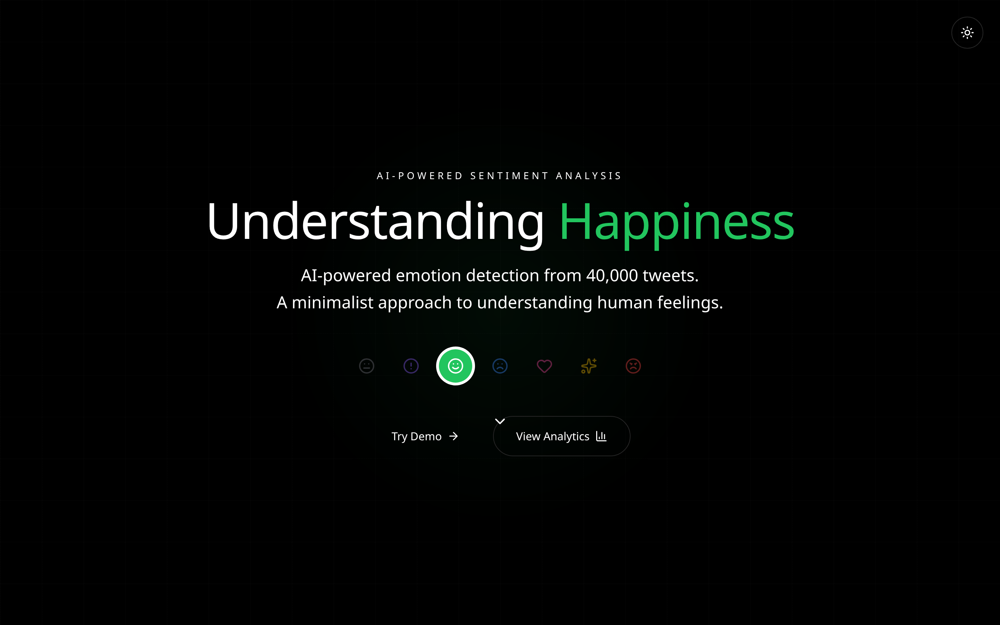
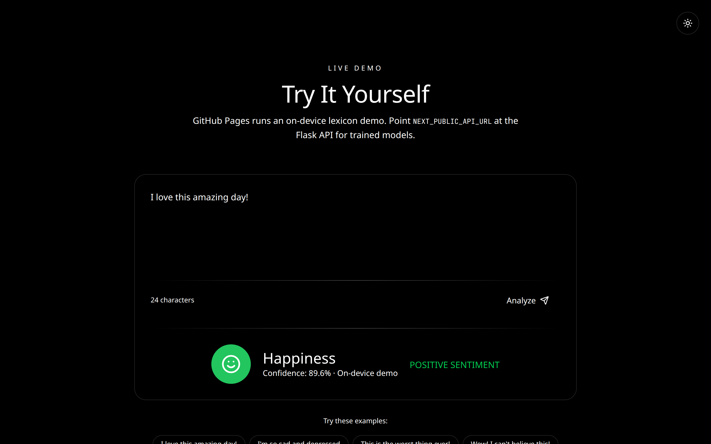
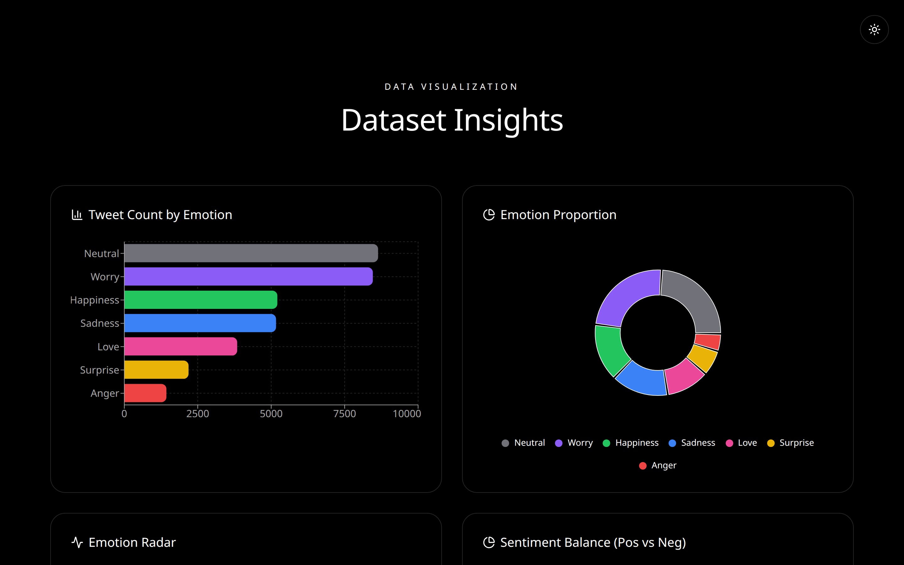
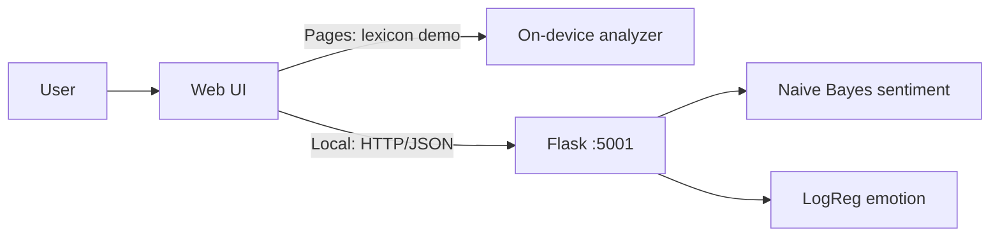

# AI-Powered Sentiment Analysis

Classifies **binary sentiment** (positive / negative) and **seven emotions** (happiness, sadness, anger, love, surprise, worry, neutral) from text. Naive Bayes and logistic regression sit behind a Flask API; the Next.js UI is the product surface.

**[Live demo](https://mangeshraut712.github.io/AI-Powered-Sentiment-Analysis/)** — GitHub Pages hosts a static export. Flask cannot run on Pages, so the hosted demo uses an on-device lexicon that still shows the product: type text, see emotion + sentiment, inspect dataset charts. Run the API locally for the trained models.


<p align="center">
  
</p>
<p align="center">
  
</p>
<p align="center">
  
</p>

## How to run

### Web UI (GitHub Pages or local static)

```bash
cd web
npm install
npm run dev          # http://localhost:3000
# or production static export:
GITHUB_PAGES=true npm run build   # writes web/out for Pages
```

### Flask API (trained models)

```bash
pip install -r requirements.txt
python -m nltk.downloader punkt stopwords wordnet
python src/app.py
# http://localhost:5001  —  POST /api/analyze  GET /api/stats  GET /health
```

With the API running, `npm run dev` in `web/` calls `http://localhost:5001` automatically. To point a build at a hosted API:

```bash
NEXT_PUBLIC_API_URL=https://your-api.example.com npm run dev
```

### CLI

```bash
python cli.py classify --text "This product is a complete failure."
python cli.py emotion --text "I am feeling wonderful today!"
python cli.py stats --top-n 15
python demo.py
```

Emotion detection needs artifacts from `python scripts/run_analysis.py` (`results/models/`).

---

## What it is

A unified NLP stack from a DSCI-521 project: movie-review-style **binary Naive Bayes** plus tweet **7-class logistic regression** (TF-IDF), with a Next.js 16 / Tailwind / Recharts UI.

| Surface | Role |
| --- | --- |
| [GitHub Pages demo](https://mangeshraut712.github.io/AI-Powered-Sentiment-Analysis/) | Static UI + on-device demo analyzer |
| `src/app.py` | Flask inference + dataset stats |
| `cli.py` | Train / evaluate / classify / emotion |



## Project structure

```
├── cli.py                  # Unified CLI
├── demo.py                 # Quick verification
├── src/
│   ├── app.py              # Flask API
│   ├── models/             # Binary + emotion classifiers
│   └── preprocessing.py
├── web/                    # Next.js UI (static export for Pages)
├── docs/screenshots/       # Product screenshots for README / portfolio
├── data/                   # Datasets
└── scripts/                # Training / analysis
```

## License

MIT — see [LICENSE](LICENSE).
